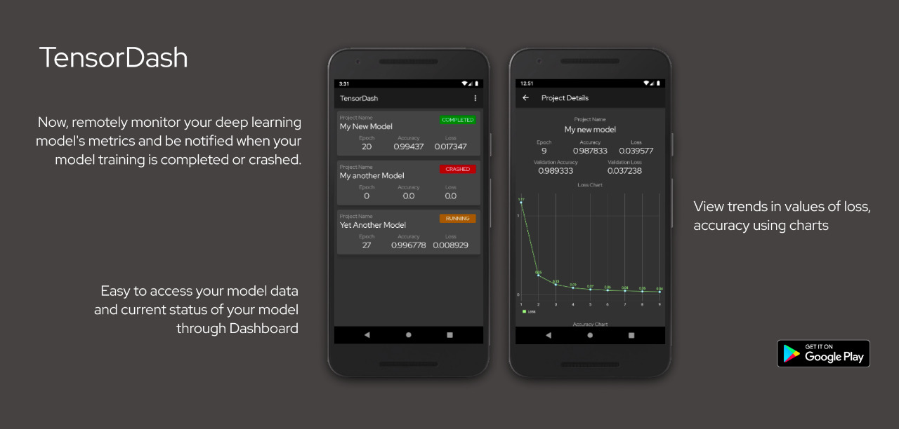

# TensorDash

TensorDash is an application that lets you remotely monitor your deep learning model's metrics and notifies you when your model training is completed or crashed.

#### [Go to docs](https://cleanpegasus.github.io/TensorDash/)

## Why Tensordash?

1. Watch your model train in real-time.
2. Supports all major deep learning frameworks.
3. Remotely get details on the training and validation metrics.
4. Get notified when your model has completed trainng or when it has crashed.
5. Get detailed graphs on your model’s metrics.


## Installation ##

### Installing the Python Package ###

There are two ways to install tensordash:

- **Install tensordash from PyPI (recommended):**

Note: These installation steps assume that you are on a Linux or Mac environment.
If you are on Windows, you will need to remove `sudo` to run the commands below.

```sh
sudo pip install tensor-dash
```

If you are using a virtualenv, you may want to avoid using sudo:

```sh
pip install tensor-dash
```

- **Alternatively: install tensordash from the GitHub source:**

First, clone TensorDash using `git`:

```sh
git clone https://github.com/CleanPegasus/TensorDash.git
```

 Then, `cd` to the TensorDash folder and run the install command:
```sh
cd TensorDash
sudo python setup.py install
```


### Installing the Android App ###

Install the android app from the play store.<br>
[](https://play.google.com/store/apps/details?id=tech.tensordash.tensordash)

## [How to use](https://cleanpegasus.github.io/TensorDash/usage/)


<table border="0">
<tr>
	<td><a href="https://cleanpegasus.github.io/TensorDash/usage/#tensorflow"><br><p align="center">Tensorflow</p></a></td>
	<td><a href="https://cleanpegasus.github.io/TensorDash/usage/#keras"> <br><p align="center">Keras</p></a></td>
	<td><a href="https://cleanpegasus.github.io/TensorDash/usage/#pytorch"> <br><p align="center">PyTorch</p></a></td>
	<td><a href="https://cleanpegasus.github.io/TensorDash/usage/#fastai"> <br><p align="center">Fast.ai</a></p>
</tr>
</table>

		


